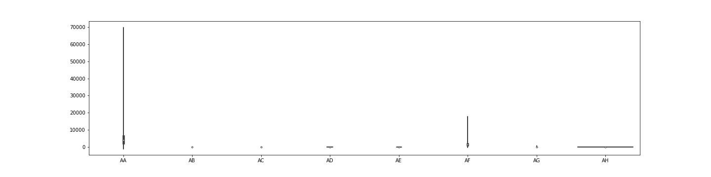
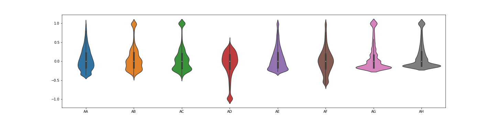

# Robout scaler

> Robust scaling for numeric data with outliers

Welcome! This repository contains the code implementing a scaler preserving outliers 
found in unscaled data. It does not discard outliers, it transforms them to a 
controllable proximity in relation to the higher density region of the scaled distribution. 
It does that by applying sigmoid transformation after an initial data scaling using the 
Robust Scaler as implemented in [scikit-learn](https://scikit-learn.org/stable/modules/generated/sklearn.preprocessing.RobustScaler.html): 
*(x-median)/(percentile(uppq)-percentile(lowq)*.
 
Thus, between *lowq* and *uppq* parameters, this scaling preserves linearity, whereas outside, 
it makes a non-linear transformation pushing the outliers to the linear region. 

Lastly, if *normalization* parameter is set to **False** or **0**, the data is centered and 
standard deviation is forced to 1 (the [standard scaling](https://scikit-learn.org/stable/modules/generated/sklearn.preprocessing.StandardScaler.html) 
procedure). If normalization is set to **True** or **1**, the data is normalized to be in
the interval between 0 and 1, else, if it is set to 2, the data is normalized to be in the 
interval between 0 and 2. 

Follows a small sample (first 5rows x 8cols) from the [testSample.csv](./tests/testSample.csv) file and a 
violin plot of the first 8 variables before scaling.

| id                    |       time |    AA |   AB |   AC |    AD |       AE |   AF |   AG |    AH |
|:----------------------|-----------:|------:|-----:|-----:|------:|---------:|-----:|-----:|------:|
| x4425323655333165260  | 1515049200 |  2200 | -118 | -119 | 0.917 | 0.006693 |  845 |    1 | 0.001 |
| x10230558070004111555 | 1515060000 |  3197 | -118 | -118 | 0.938 | 0.026903 | 1352 |    2 | 0.002 |
| x18350715752638066598 | 1515006000 |    75 | -108 |  -99 | 0.427 | 0.033111 |  149 |  417 | 0.125 |
| x10230558070004111555 | 1515150000 |  2967 | -118 | -119 | 0.944 | 0.021121 | 1420 |    1 | 0.001 |
| x16587885833987648653 | 1515186000 | 10395 | -119 | -120 | 0.944 | 0.069466 | 1943 |    0 | 0     |





After the Robout scaling (without standardization) the same sample and the violin plots look as follows:

| id                    |       time |    AA |    AB |    AC |    AD |    AE |    AF |    AG |    AH |
|:----------------------|-----------:|------:|------:|------:|------:|------:|------:|------:|------:|
| x4425323655333165260  | 1515049200 | 0.447 | 0.531 | 0.526 | 0.492 | 0.427 | 0.421 | 0.5   | 0.515 |
| x10230558070004111555 | 1515060000 | 0.478 | 0.542 | 0.555 | 0.529 | 0.474 | 0.495 | 0.531 | 0.538 |
| x18350715752638066598 | 1515006000 | 0.383 | 0.964 | 0.998 | 0.032 | 0.489 | 0.325 | 1     | 1     |
| x10230558070004111555 | 1515150000 | 0.471 | 0.529 | 0.529 | 0.539 | 0.461 | 0.505 | 0.5   | 0.505 |
| x16587885833987648653 | 1515186000 | 0.694 | 0.447 | 0.443 | 0.538 | 0.574 | 0.581 | 0.469 | 0.474 |


After applying standardization, this is the result:

| id                    |       time |     AA |     AB |     AC |     AD |     AE |     AF |     AG |     AH |
|:----------------------|-----------:|-------:|-------:|-------:|-------:|-------:|-------:|-------:|-------:|
| x4425323655333165260  | 1515049200 | -0.714 | -0.043 | -0.094 |  0.21  | -0.919 | -0.797 | -0.332 | -0.267 |
| x10230558070004111555 | 1515060000 | -0.398 |  0.037 |  0.107 |  0.5   | -0.496 | -0.117 | -0.12  | -0.102 |
| x18350715752638066598 | 1515006000 | -1.37  |  3.134 |  3.086 | -3.428 | -0.364 | -1.675 |  3.067 |  3.235 |
| x10230558070004111555 | 1515150000 | -0.471 | -0.054 | -0.071 |  0.585 | -0.618 | -0.026 | -0.332 | -0.334 |
| x16587885833987648653 | 1515186000 |  1.786 | -0.659 | -0.651 |  0.574 |  0.401 |  0.675 | -0.544 | -0.562 |


## Installation

The installation of Robout scaler requires [Pandas](https://pandas.pydata.org/pandas-docs/stable/getting_started/install.html) and [Numpy](https://numpy.org/install/).

The latest release of Robout scaler can be installed from [PyPI](https://pypi.org/project/robout/0.0.1/) using ``pip``:

```sh
    pip install robout
```

Or via conda:

```sh
    conda install -c pedro-r-dias robout
```


## Usage example

Follows a data scaling example using *fit_transform* (Robout scaler also includes the *transform* method). 

```python
import pandas as pd
import seaborn as sns
import matplotlib.pyplot as plt
import robout as rbt

df = pd.read_csv(".\\tests\\testSample.csv")

rs = rbt.robout_scaler(normalization=0, ignore=["time"])
scaled = rs.fit_transform(df)

f, ax = plt.subplots(figsize=(20, 5))
sns.violinplot(data=scaled.iloc[:,2:10])
```


To revert the scaling use the inverse_transform method as follows:

```python
unscaled = rs.inverse_transform(scaled)
unscaled.iloc[:5,:10]
```

| id                    |       time |    AA |   AB |   AC |    AD |       AE |   AF |   AG |     AH |
|:----------------------|-----------:|------:|-----:|-----:|------:|---------:|-----:|-----:|-------:|
| x4425323655333165260  | 1515049200 |  2200 | -118 | -119 | 0.917 | 0.006693 |  845 |    1 |  0.001 |
| x10230558070004111555 | 1515060000 |  3197 | -118 | -118 | 0.938 | 0.026903 | 1352 |    2 |  0.002 |
| x18350715752638066598 | 1515006000 |    75 | -108 |  -99 | 0.427 | 0.033111 |  149 |   92 |  0.125 |
| x10230558070004111555 | 1515150000 |  2967 | -118 | -119 | 0.944 | 0.021121 | 1420 |    1 |  0.001 |
| x16587885833987648653 | 1515186000 | 10395 | -119 | -120 | 0.944 | 0.069466 | 1943 |    0 | -0     |


## Comparison with other scaling methods

### Robout scaler


### Standard scaler


### Robust Scaler


### MinMax Scaler


### Fibonacci scaler


## Release History

* 0.1.1
    * Documentation updates
* 0.1.0
    * Ready
* 0.0.1
    * Work in progress

## Meta

Pedro Dias – pedroruivodias@gmail.com

Distributed under the MIT license. See ``LICENSE`` for more information.


## Contributing

1. Fork it (<https://github.com/yourname/yourproject/fork>)
2. Create your feature branch (`git checkout -b feature/fooBar`)
3. Commit your changes (`git commit -am 'Add some fooBar'`)
4. Push to the branch (`git push origin feature/fooBar`)
5. Create a new Pull Request
